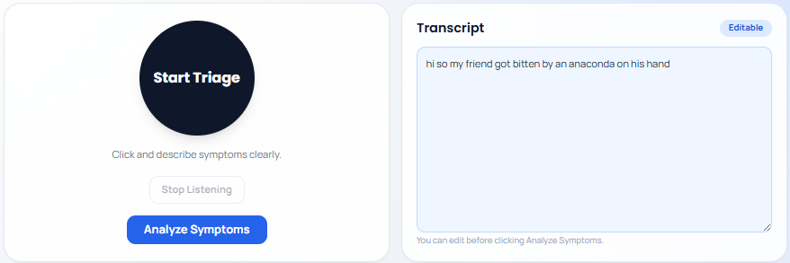
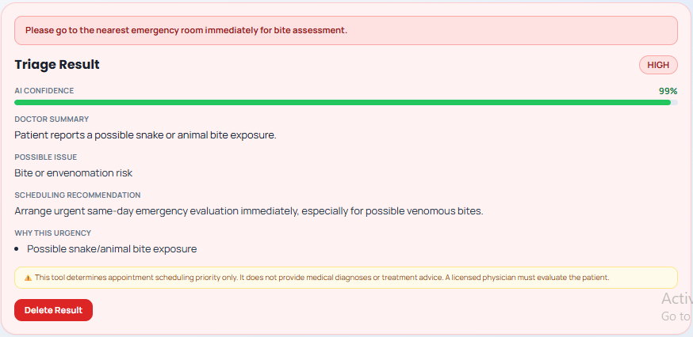
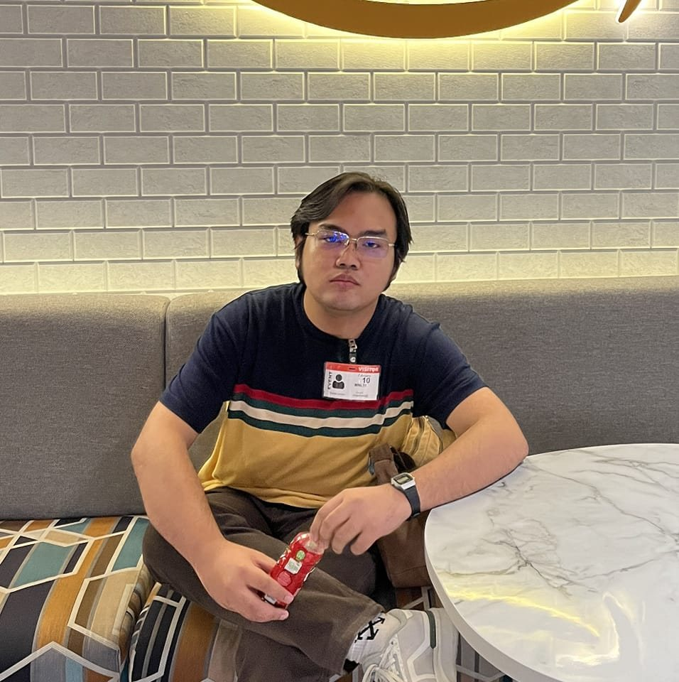
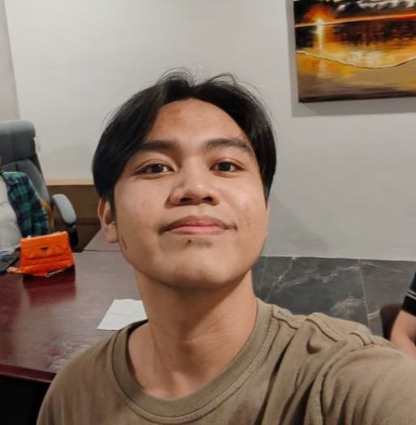

# AI Medical Symptom Triage and Scheduling Assistant


Live Application Here : https://lingapp-maf.vercel.app/

An AI-assisted medical intake system that lets patients speak or type their symptoms, summarizes their concerns into a cleaner clinical format, and helps triage urgency before suggesting available doctor schedules near the patient.

> The LLM used for categorizing urgency is based on the National Health Services' data of UK.

## Features

- **Voice and Text Input**: Patients can open the app and either speak or write their symptoms.
- **Smart Symptom Summary**: The assistant generates a cleaner, structured summary from free-form input.
- **Structured Intake Details**: The system extracts and organizes:
  - Current Date
  - Date the symptom started
  - Area of Concern
  - Symptoms
  - Other Additional Information (the AI can ask follow-up questions when needed)
- **Urgency Categorization**: The AI classifies symptom urgency based on the provided details.
- **Doctor Schedule Suggestions**: Based on urgency, the system suggests open doctor schedules the patient can choose from, prioritized by nearby hospitals/clinics.


| Layer | Technology | Description | Project Usage |
| --- | --- | --- | --- |
| Frontend Framework | React | Component-based UI library for building interactive single-page applications. | Powers patient intake, transcript editing, triage result rendering, and follow-up question interactions. |
| Frontend Router | React Router DOM | Client-side routing for navigation without full page reloads. | Manages page-level navigation between app views inside the web client. |
| Frontend Build Tool | Vite | Fast dev server and modern frontend bundler using native ESM. | Runs local frontend development server and creates production frontend builds. |
| Frontend Styling | Tailwind CSS | Utility-first CSS framework for rapid, consistent UI styling. | Styles triage cards, voice controls, status badges, and layout spacing. |
| CSS Processing | PostCSS + Autoprefixer | CSS transformation pipeline with automatic vendor prefixing. | Ensures cross-browser compatible styling for UI components. |
| Realtime Voice SDK | Agora RTC SDK | Real-time audio communication SDK for browser-based voice features. | Handles live voice capture and RTC session behavior for patient voice workflows. |
| Conversational AI Engine | Agora Conversational AI | Cloud conversational voice agent service integrated with RTC channels. | Supports optional two-way conversational AI flow through `/conversationalAgent/start` and `/conversationalAgent/stop` backend routes. |
| Backend Runtime | Node.js | JavaScript runtime for server-side APIs and integrations. | Runs Express backend for triage analysis, conversational agent control, and speech synthesis endpoints. |
| Backend API Framework | Express | Lightweight web framework for routing and middleware. | Exposes `/analyzeSymptoms`, `/health`, conversational-agent endpoints, and `/speech/synthesize`. |
| Backend Middleware | CORS | Middleware for controlled cross-origin HTTP access. | Allows frontend app origin to call backend APIs during local development and deployment. |
| Environment Management | dotenv | Loads `.env` variables into runtime configuration. | Injects provider keys, model settings, Agora credentials, and Azure Speech settings at server startup. |
| LLM Provider | Groq | High-speed inference provider with OpenAI-compatible chat completions API. | Primary provider for dynamic triage output and meaningful follow-up question generation. |
| LLM Provider (Alternative) | OpenRouter / Together | Aggregated and multi-model LLM access providers. | Optional fallback providers when `LLM_PROVIDER` is set to `openrouter` or `together`. |
| LLM / TTS Provider (Optional) | Gemini | Google model provider used in optional CAE TTS or model integrations. | Used when CAE TTS vendor is configured as `gemini/google` and Gemini API credentials are supplied. |
| Speech Synthesis | Azure Speech Service | Cloud text-to-speech service for natural voice output. | Backend `/speech/synthesize` converts text responses to audio using configured Azure voice and locale. |
| Deployment Config | Vercel Rewrites | Serverless routing configuration for production API path rewrites. | Routes all backend requests to `api/index.js` when deployed in Vercel environment. |

## Project Overview

This project is a voice-enabled AI medical intake and triage web application. It captures patient symptom descriptions (voice or text), sends them to a backend triage service, and returns structured urgency output (ESI level, urgency band, summary, possible issue, and scheduling recommendation). It also supports one follow-up question round for better triage confidence and optional conversational voice agent capabilities through Agora.

## Setup

### Prerequisites

- Node.js 18+ (recommended)
- npm
- A modern browser with microphone access enabled

### 1) Backend setup

```bash
cd SourceCode/backend
npm install
```

Create backend environment file:

```bash
copy .env.example .env
```

Minimum backend configuration:

- `LLM_PROVIDER=mock` for local testing without external LLM calls
- or `LLM_PROVIDER=groq` with `LLM_API_KEY=<your_key>`
- `LLM_MODEL=llama-3.1-8b-instant` (or your preferred compatible model)

Start backend:

```bash
npm run dev
```

Backend default URL: `http://localhost:4000`

### 2) Frontend setup

```bash
cd SourceCode/frontend
npm install
```

Create frontend environment file:

```bash
copy .env.example .env
```

Minimum frontend configuration:

- `VITE_API_BASE_URL=http://localhost:4000`
- `VITE_ENABLE_CONVERSATIONAL_AI=false` for standard triage flow

Start frontend:

```bash
npm run dev
```

Frontend default URL: `http://localhost:5173`

## Usage

1. Start backend first, then frontend.
2. Open the frontend URL in your browser.
3. Allow microphone permission when prompted.
4. Click **Start Triage** and describe symptoms, or type directly in the transcript box.
5. Click **Analyze Symptoms** to get triage output.
6. If a follow-up question appears, answer it to improve triage confidence.

## Special Run Instructions

- Keep `LLM_PROVIDER=mock` when you want deterministic local testing without API costs.
- Use `LLM_PROVIDER=groq` for meaningful dynamic follow-up questions and better triage quality.
- If conversational AI is enabled (`VITE_ENABLE_CONVERSATIONAL_AI=true`), you must configure Agora and backend CAE variables (`AGORA_APP_ID`, `AGORA_CUSTOMER_ID`, `AGORA_CUSTOMER_SECRET`, and CAE-related settings).
- For `/speech/synthesize`, set Azure Speech variables in backend `.env` (`AZURE_SPEECH_API_KEY` and either `AZURE_SPEECH_REGION` or `AZURE_SPEECH_ENDPOINT`).
- Voice features depend on browser microphone permission and secure context behavior; localhost is supported for development.

---

## Patient Flow (Web App)

The web experience is designed for fast intake and triage with AI-guided follow-ups.

Try the patient workflow here: https://lingapp-maf.vercel.app/

### Front Banner and Intake Screen


### Symptom Summary and Urgency Classification


---

## Backend AI Workflow

The backend handles AI response generation, symptom cleaning, and triage-ready formatting for scheduling recommendations.


---
## Comprehensive Repository Structure

```text
MAF/
├── Source Code/
│   ├── backend/                          # Express API and triage logic
│   │   ├── server.js                     # Main backend server
│   │   ├── triageController.js           # Symptom cleanup and urgency flow
│   │   ├── package.json                  # Backend dependencies and scripts
│   │   └── .env.example                  # Environment variable template
│   └── frontend/                         # Vite-based client application
│       ├── src/                          # React source files
│       ├── img/                          # Member photos and project images
│       ├── package.json                  # Frontend dependencies and scripts
│       └── index.html                    # Frontend HTML entry
├── NEW_README.md                         # Updated project documentation
├── README.md                             # Legacy/readme reference
└── .gitignore                            # Git ignore rules
```

---
## Project Members

<table align="center" border="0" cellpadding="0" cellspacing="0" width="100%">
  <tr>
    <td align="center" width="50%">
      <br>
      <strong>Eliazar Inso</strong><br>
      <a href="#">
        
      </a>
    </td>
    <td align="center" width="50%">
      <br>
      <strong>Adriel Magalona</strong><br>
      <a href="#">
        
      </a>
    </td>
  </tr>
  <tr>
    <td align="center" width="50%" style="padding-top: 20px;">
      <br>
      <strong>Hanzlei Jamison</strong><br>
      <a href="#">
        
      </a>
    </td>
    <td align="center" width="50%" style="padding-top: 20px;">
      <br>
      <strong>Vincent Puti</strong><br>
      <a href="#">
        
      </a>
    </td>
  </tr>
</table>

